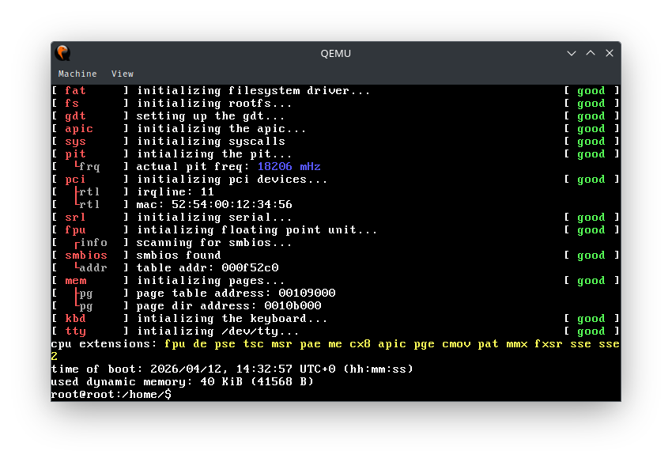
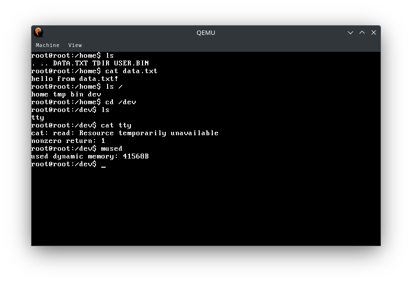
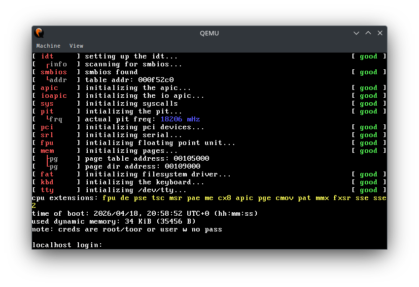
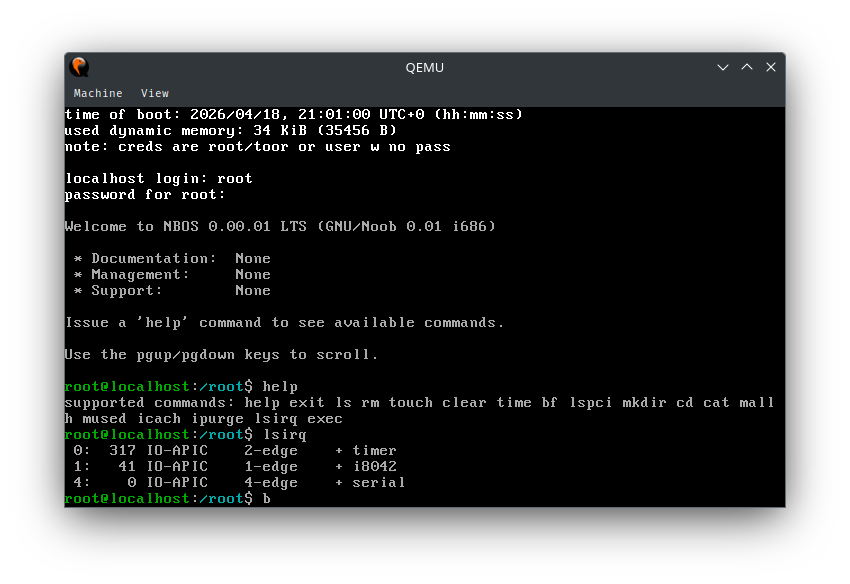

# noob-os
### do not try at home
this is undoubtedly the most useless bootable software in the world.

aanyways just run `make` and bin/os.img should pop up. in addition, `make run` should run the executable (using qemu-system-i386).

### synopsis
currently the kernel is about 40 kB in size, has vfs and part-working kernel mode "shell" (unfun commands). nothing interesting, though.  

also it uses grub as a bootloader (see `grub/initdsk.img`) and is compressed using LZMA, thus resulting in a 22 kB compressed elf image, and

*i must stress that this hobby project does not have and will never have any production usability.*

#### technical details
prerequisites you *must* have before compiling:
```
clang
nasm
lld
llvm
mtools
qemu-system-i386
python3 (optional)
e2tools
xz
```
while others, `find`, `truncate`, et cetera are assumed to already be on your system  

and this might be the current memory map:
```
high memory
+==============+
|              |
| stuff?       |
+--------------+ 0x00300000
|              |
|              |
|              |
| kernel heap  | ≈ 60KB
+- - - - - - - + 0x00200000 1 MiB
|              |
|              |
| uncompressed |
| kernel text  |
+==============+ 0x00100000 1 MiB

```


fun fact: i specifically used `clang` and the llvm toolchain instead of a gcc cross compiler so that i can compile the project on my mobile phone (via termux), where there cross compilers are the hardest and most painful to install!

## screenshot
### 04/12 (acdf7f2)

FAT12 filesystem thing





### 04/19 (0c9a8cb)

still chubby, but added /etc files (see `data/`)





*these text might make you assume the kernel's advanced, but in reality it never was THAT complex*

## legal notice
this is still a hobby OS project, it doesn't store, process, or use any kind of user data. it is also void of and does not provide accounts, services, or content.

so things like age verification / platform regulation (see California AB-1043 & Brazil Law No. 15.211/2025) doesn't really apply "in my opinion". therefore, you are still allowed to locally distribute this software from within these region, but be aware that any unforeseeable legal consequences... can *probably* befall you.
